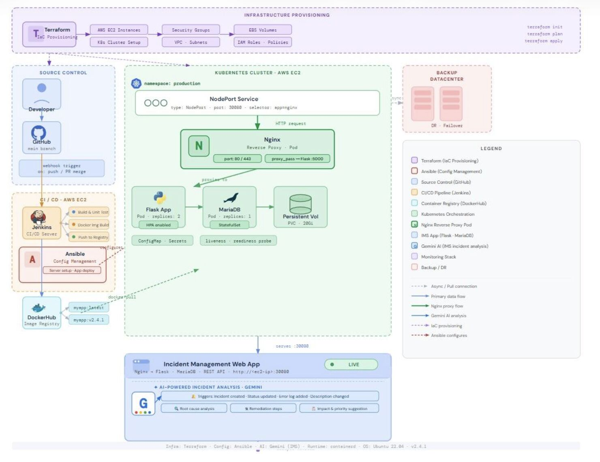
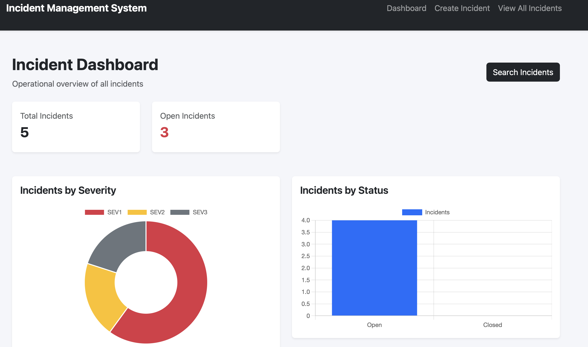
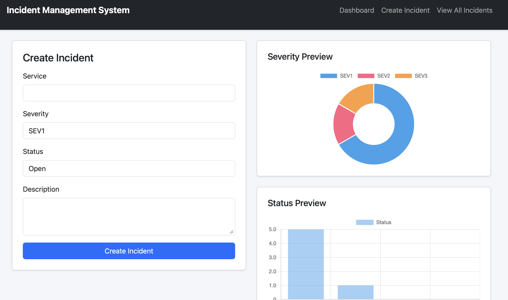
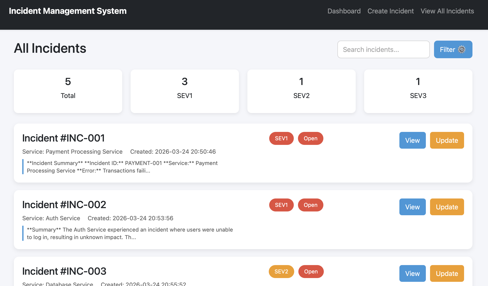
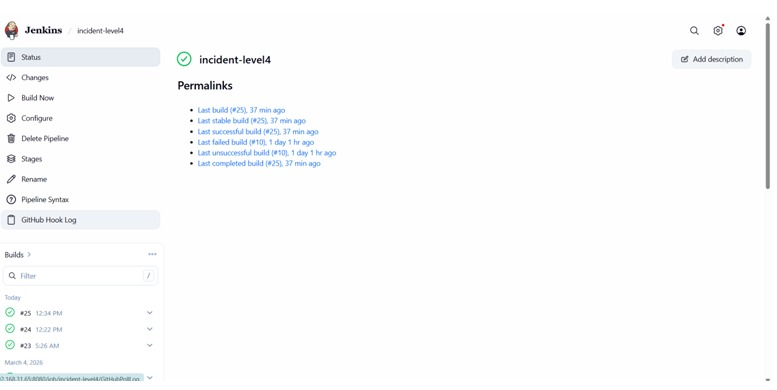
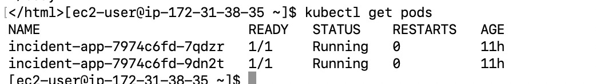
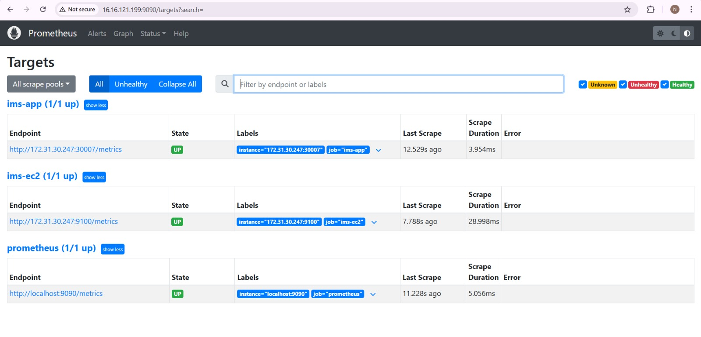
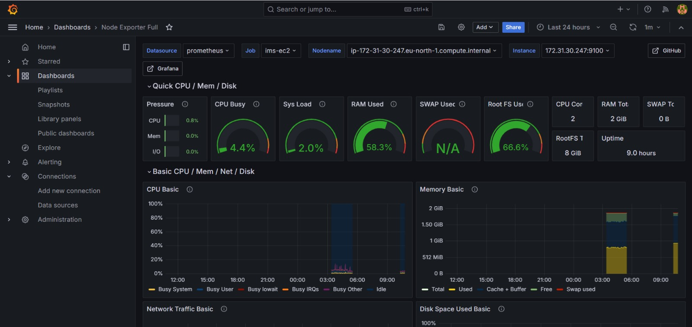
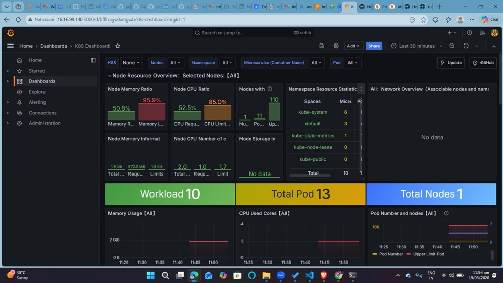
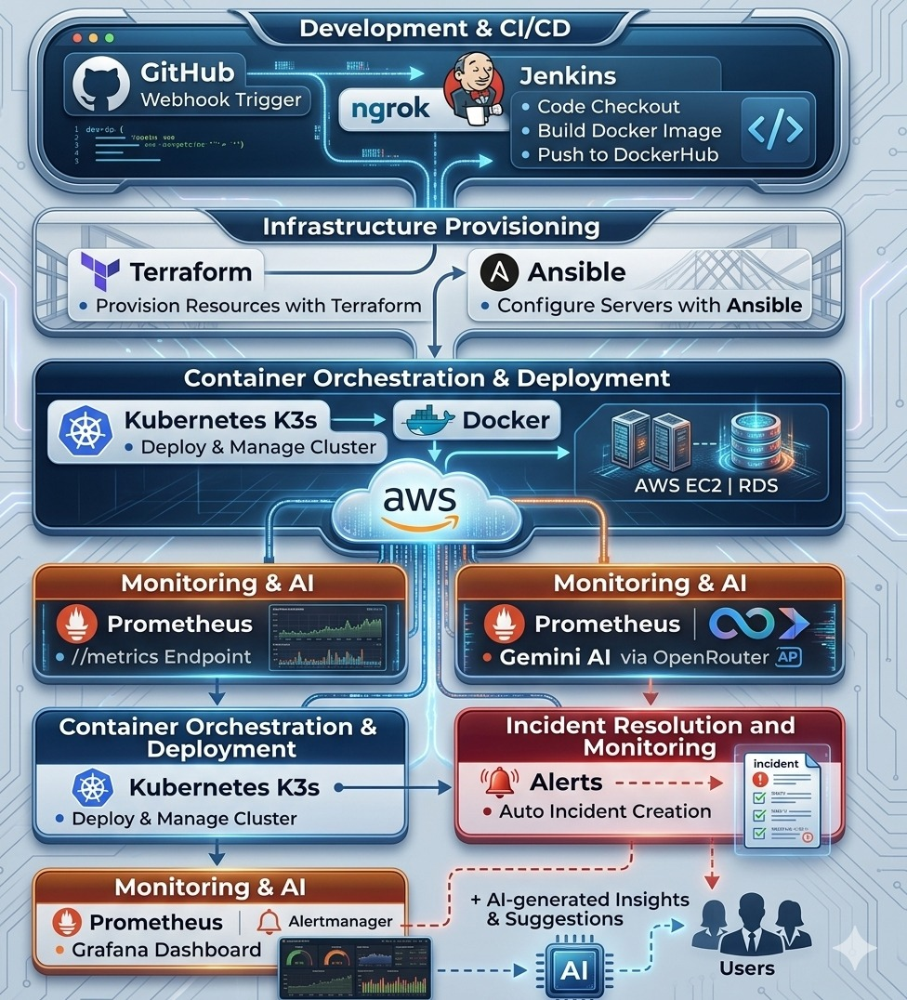

# 🚀 Incident Management System (IMS)

> A **production-grade DevOps project** demonstrating end-to-end deployment of a scalable Incident Management System with **Kubernetes, CI/CD, AI integration, and cloud infrastructure**.

---

## 🏗️ Architecture Diagram

Below is the complete system architecture showing how infrastructure provisioning, CI/CD, containerization, orchestration, and monitoring are connected.



---

## 🏆 Highlights

* ⚡ Production-ready stack (**NGINX + Gunicorn + Flask**)
* ☸️ Kubernetes-based deployment (Pods, Services, HPA)
* 🔁 Automated CI/CD with Jenkins
* 🐳 Dockerized architecture
* ☁️ AWS RDS integration
* 📊 Monitoring with Prometheus & Grafana
* 🔗 Webhook-based CI/CD triggering using **ngrok**
* 🤖 AI-powered incident analysis

---

## 📸 Application Preview 

### 📝 Dashboard

This is the main landing page providing a quick overview of incidents and system status.



---

### 📝 Create Incident

This screen allows users to create and log new incidents with relevant details.



---

### 📋 View Incidents

Displays all incidents with their status, severity, and AI-generated insights.



---

## ⚙️ DevOps Pipeline

### 🔗 Webhooks with ngrok (GitHub → Jenkins)

During development, **ngrok is used to expose the local Jenkins server to the internet**, enabling GitHub webhooks to trigger the pipeline automatically.

- GitHub push → Webhook trigger  
- ngrok → Public endpoint for local Jenkins  
- Jenkins → Starts CI/CD pipeline  

📌 **Why this matters:**
- Simulates real production webhook behavior  
- Eliminates need for publicly hosted Jenkins during development  
- Enables fully automated CI/CD locally  

---

### 🔁 Jenkins CI/CD Pipeline

This pipeline automates build, test, Docker image creation, and deployment to Kubernetes.



---

### ☸️ Kubernetes Pods

Shows running application pods ensuring scalability and high availability.



---

### 📊 Prometheus Dashboard

Displays application-level metrics and monitoring data.



---

### 📊 Grafana Dashboard

Visualizes system metrics such as CPU, memory, and application performance.



---

### ☸️ Kubernetes Monitoring in Grafana

Shows Kubernetes cluster metrics integrated into Grafana dashboards.



---

## 🐳 Docker + Kubernetes Flow

1. Code pushed to GitHub  
2. Jenkins pipeline triggered via webhook  
3. Docker image built and pushed to DockerHub  
4. Kubernetes pulls latest image  
5. Pods created and managed  
6. NGINX exposes the application  

---

## 🌐 Production Stack Deep Dive

### 🔹 NGINX

Acts as a reverse proxy handling incoming HTTP requests and forwarding them to Gunicorn.

---

### 🔹 Gunicorn

WSGI server that runs the Flask application with multiple worker processes for handling concurrent requests.

---

### 🔹 Flask Application

Implements business logic, APIs, and incident management functionality.

---

### 🔹 Database Layer

#### Local Development
- MariaDB running via Docker  

#### Production
- AWS RDS (Managed MySQL)

📌 Accessed using tools like MySQL Workbench via RDS endpoint.

---

## 🤖 AI-Powered Incident Analysis

* Root cause detection  
* Suggested fixes  
* AI-generated incident summaries  

---

## 📡 Monitoring & Observability

### Prometheus
Collects application and system metrics.

### Grafana
Provides real-time dashboards for monitoring and visualization.

---

## 🔐 Secrets & Configuration

Managed securely using:
- Jenkins Credentials  
- Kubernetes Secrets  

---

## 🏅 Badges


---
## 📂 Project Structure

```
.
├── app/
├── templates/
├── static/
├── Dockerfile
├── docker-compose.yml
├── deployment.yaml
├── service.yaml
├── Jenkinsfile
├── ansible/
├── monitoring/
└── README.md
```

---

## 🚀 Local Setup

```bash
git clone <repo>
cd <repo>
docker-compose up --build
```

---

## ⭐ Final Note

This project demonstrates a **complete DevOps lifecycle with AI integration**, making it a strong portfolio project for real-world engineering roles.

## 💡 Deployment Note

This system is fully production-ready and deployable on AWS (EC2, RDS, Kubernetes).  
To follow **cost-efficient cloud practices**, the infrastructure is provisioned and used on-demand rather than running continuously.


## 🏗️ Visual Diagram to understand workflow

